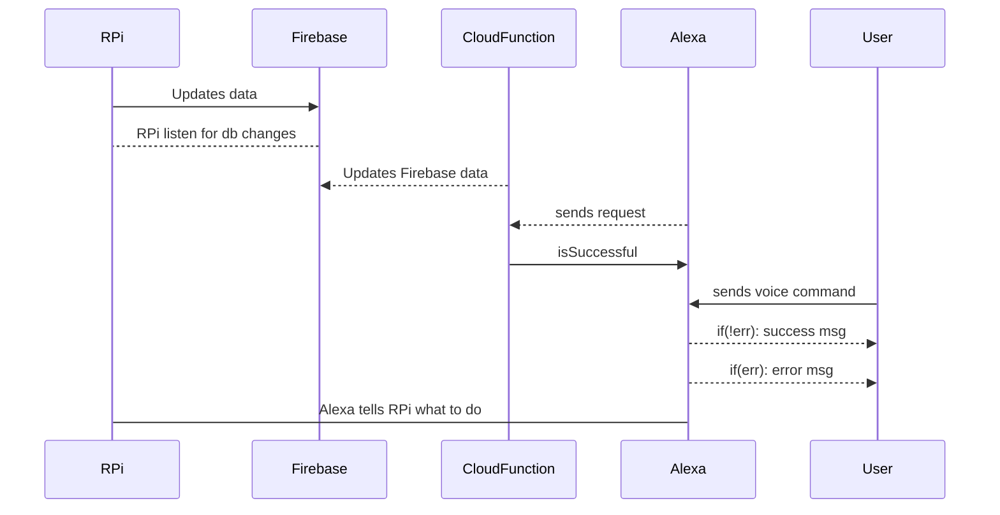

## Communication Flow
Interactions between user to alexa and alexa to RPi

```mermaid
sequenceDiagram
RPi ->> Firebase: Updates data
Firebase --> RPi: RPi listen for db changes
CloudFunction -->> Firebase: Updates Firebase data
Alexa -->> CloudFunction: sends request
CloudFunction ->> Alexa: isSuccessful
User ->> Alexa: sends voice command
Alexa -->> User: if(!err): success msg
Alexa -->> User: if(err): error msg
RPi->Alexa:Alexa tells RPi what to do
```